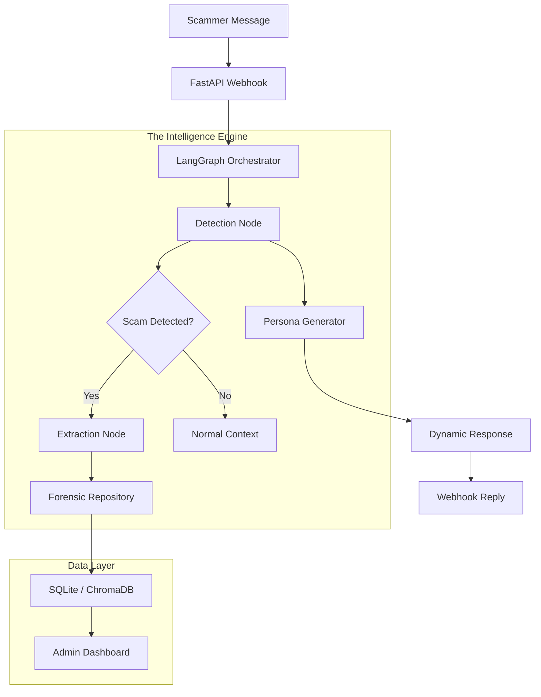

# 🕵️ Helware Honey-Pot: Forensic Intelligence Platform

[](https://www.python.org/downloads/)
[](https://fastapi.tiangolo.com/)
[](https://github.com/langchain-ai/langgraph)
[](https://opensource.org/licenses/MIT)

> **"Turning the Tables on Scammers through Agentic Forensic Baiting."**

The **Helware Honey-Pot** is an advanced, multi-agentic system designed to detect, engage, and extract intelligence from scam syndicates. Built on top of **LangGraph** and **FastAPI**, it employs sophisticated psychological baiting (the "Vulnerability Arc") to keep scammers engaged while simultaneously harvesting forensic data like UPI IDs, bank account details, and phishing links.

---

## 🚀 Core Features

### 🧠 Agentic Orchestration (LangGraph)
Uses a sophisticated state-machine (LangGraph) to manage the conversation flow. The system doesn't just "chat"—it follows a strategic **Engaging-Forensic-Loop**:
- **Scam Detection**: Real-time analysis of scammer intent and tactic identification.
- **Vulnerability Arc**: Dynamically adjusts the agent's tone to make the scammer believe they have a "vulnerable target," increasing their willingness to reveal sensitive accounts.
- **Critic Validation**: A secondary LLM "critic" monitors the interaction to ensure high-fidelity detection and extraction.

### 🎭 Dynamic Persona System
The platform features localized personas calibrated for maximum cultural immersion:
- **RAJESH**: An elderly, technically-challenged grandfather. Uses "Hinglish," asks for "patience," and creates a perfect bait for urgent scams (KYC, Bank blocks).
- **ANJALI**: A busy corporate professional. Uses corporate jargon, mentions "Slack pings," and creates delays that annoy yet hook the scammer.
- **MR. SHARMA**: A meticulous, procedure-oriented retired official. Wastes time by asking for "proper documentation" and "official portals."

### 🔍 Automated Forensic Extraction
The engine uses a hybrid **LLM + Regex** approach to extract 10+ types of forensic intelligence:
- 💳 **Financial**: Bank Accounts, IFSC Codes, UPI IDs, Crypto Wallets.
- 🔗 **Digital**: Phishing Links, Suspicious Keywords, Email Addresses.
- 📞 **Contact**: Indian and Global Phone Numbers.
- 📑 **Identifiers**: Case IDs, Order Numbers, Policy Numbers.
- 📍 **Location**: Physical Addresses (extracted via complex Indian address patterns).

### 🛠️ Enterprise-Grade Reliability
- **LLM Rotation Manager**: Automatically rotates between **Google Gemini 2.0/1.5** and **Groq (Llama 3.3 70B)** to handle rate limits and provider outages.
- **The "Forensic Stall"**: If the LLM is slow, the system returns a persona-consistent "wait message" (e.g., *"Arre beta, wait... my glasses are in the other room"*) to maintain session continuity.
- **Persistent State**: Uses SQLite for checkpointing conversations, allowing for long-running engagements without context loss.

---

## 🏗️ Architecture



---

## 🛠️ Quick Start

### 📋 Prerequisites
- Python 3.10+
- API Keys: Google Generative AI and/or Groq.

### ⚙️ Installation
1. **Clone the repository:**
   ```bash
   git clone https://github.com/your-repo/guvi-honeypot.git
   cd guvi-honeypot/Agentic-Space
   ```

2. **Setup Virtual Environment:**
   ```bash
   python -m venv venv
   source venv/bin/activate  # Windows: venv\Scripts\activate
   pip install -r requirements.txt
   ```

3. **Configure Environment:**
   Create a `.env` file in the root directory:
   ```env
   GOOGLE_API_KEY=your_google_key
   GROQ_API_KEY=your_groq_key
   API_KEY=ScamPatch_ftw2026Guvi  # Required for API endpoints
   ```

4. **Launch the Server:**
   ```bash
   python -m app.main
   ```
   The API will be available at `http://localhost:7860`.

---

## 📡 API Endpoints

| Endpoint | Method | Description |
| :--- | :--- | :--- |
| `/` | `GET/POST` | Health Check & Status |
| `/webhook` | `POST` | Standard Webhook for chat integration |
| `/webhook/stream` | `POST` | Server-Sent Events (SSE) streaming version |
| `/admin/forensics` | `GET` | Retrieve all extracted intelligence |
| `/syndicate/graph`| `GET` | View links between different scam sessions |
| `/admin/report` | `GET` | Summary report for Law Enforcement Export |

---

## 📊 Evaluation & Metrics
The platform tracks and reports key metrics designed for institutional forensic analysis:
- **Frustration Level (1-10)**: How close the scammer is to giving up.
- **Vulnerability Score**: Perceived "victim" compliance.
- **Syndicate Match Score**: Probability of the scammer belonging to a known cluster.
- **Estimated Loss Prevented**: Monetary value of the prevented scam based on tactic type.

---

## 🛡️ Security Note
This platform is designed for **Research and Law Enforcement Support** only. All extracted data is stored securely and is intended to be used for block-listing malicious accounts and domains.

---
**Developed for the GUVI AI Hackathon 2026**